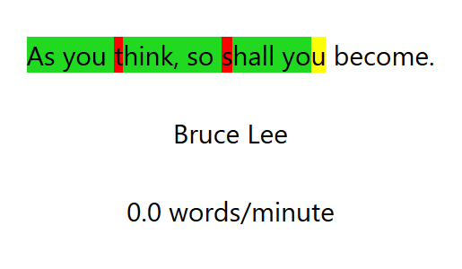

# touch typing webapp
A simple webapp to practice touch typing made with reactjs.

## installation
```console
npm install
```

## run the webapp
```console
npm start
```

## controls
Press 'Enter' to get a new random quote.
To start typing you need to click on the quote on screen.

## showcase

